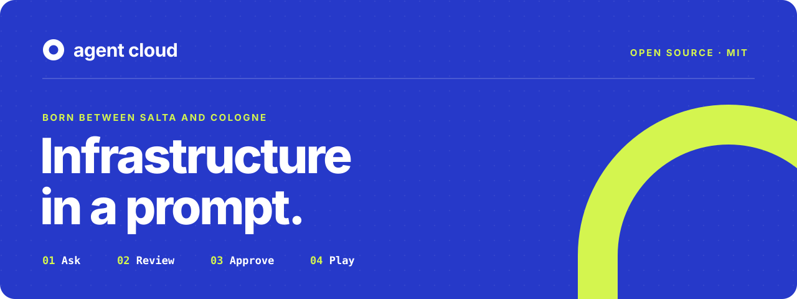
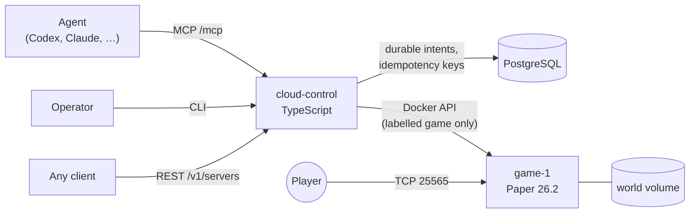

<p align="center">
  
</p>

<p align="center">
  <b>Ask an agent for a Minecraft server. Get a playable address. Keep your world.</b><br>
  <sub>Infraestructura en un prompt · open source under the <a href="LICENSE">MIT license</a></sub>
</p>

<p align="center">
  <a href="#quickstart">Quickstart</a> ·
  <a href="#how-it-works">How it works</a> ·
  <a href="#what-is-proven">Evidence</a> ·
  <a href="#roadmap">Roadmap</a> ·
  <a href="#the-story">The story</a>
</p>

---

**Agent Cloud** is an open platform for requesting servers and digital services in natural language. The platform proposes what it will create, what limits apply and what it costs; nothing runs until a person approves it. The complexity stays in the platform, and the decision stays with the person.

This first public release is the **reproducible foundation**: a single-host Docker Compose stack that turns one agent request into a real, playable Minecraft Java server with a persistent world, exposed through the same lifecycle over **REST**, **MCP** and a **CLI**.

```text
you  ▸ "I want a private Minecraft server to play tonight."
agent ▸ minecraft_create { name: "tonight", eula_accepted: true }
cloud ▸ 202 accepted · state: starting
cloud ▸ running · endpoint 127.0.0.1:25565   ← only after a real Minecraft handshake
```

## Quickstart

You need Git, Docker with Compose v2, Node.js 22+ and at least 2 CPUs, 4 GiB RAM and 4 GiB free disk for Docker. Linux and macOS on arm64 and amd64 are supported.

```sh
git clone https://github.com/147pop/agent-cloud.git
cd agent-cloud
cp infra/compose/config.example.env .env && chmod 600 .env
# edit .env: set CLOUD_MACHINE_TOKEN, POSTGRES_PASSWORD and MINECRAFT_EULA=TRUE
bash infra/compose/setup.sh
```

Then create your server from the CLI:

```sh
npm ci && npm run build
set -a; . ./.env; set +a
npm run -s cloud -- create tonight --accept-eula --wait
```

Point a Minecraft Java client at the printed `host:port`. Stop safely with `bash infra/compose/shutdown.sh`; your world survives shutdowns, restarts and reinstalls.

Setting `MINECRAFT_EULA=TRUE` means you accept the [Minecraft EULA](https://www.minecraft.net/eula). The full guide, including update, recovery and LAN exposure, is the [single-host Compose quickstart](infra/compose/README.md).

<details>
<summary><b>Prefer to watch the whole journey run by itself?</b></summary>

```sh
bash infra/compose/journey.sh --accept-eula
```

It performs setup, REST create and status, a real Minecraft protocol handshake, the four MCP tools, the CLI, a world marker across stop and start, the second-create capacity check and a safe shutdown. Each step prints its duration, and the script stops at the first failure.

</details>

## How it works



| Piece | What it does |
| --- | --- |
| **`cloud-control`** | One lifecycle contract: `create`, `status`, `start`, `stop`. It records every intent and its `client_request_id` in PostgreSQL before touching Docker, so retries return the original result and a control restart resumes the work. |
| **Three interfaces, one contract** | REST at `/v1/servers`, MCP at `/mcp` (`minecraft_create`, `minecraft_status`, `minecraft_start`, `minecraft_stop`) and the `cloud` CLI, all behind the same bearer token. |
| **Honest readiness** | An endpoint appears only after a real Minecraft protocol status request succeeds. |
| **Safe stops** | Paper gets a 120-second save grace period. Named volumes keep PostgreSQL and the world across stop, recreation and reinstall. |
| **Deliberate limits** | One logical server per installation. A second, distinct create returns `409 capacity_unavailable` and never replaces your world. Creation refuses with `507` when free disk falls below the reserved threshold. |

The selected game profile is Paper 26.2 with two CPUs, a 2 GiB heap and a 3 GiB container limit, qualified for two concurrent players. The Paper container never receives Docker or host credentials.

## What is proven

Every claim above has published evidence, recorded from a clean clone:

| Result | Evidence |
| --- | --- |
| Agent-to-play journey over REST, MCP and CLI | [F4.1 journey](infra/evidence/tes-155-agent-to-play-journey.md) |
| Racing creates, repeated keys, control restart mid-operation, container recreation | [F4.2 adversarial trials](infra/evidence/tes-156-persistence-idempotency-restart.md) |
| Reproduction on macOS arm64, Linux arm64 and amd64 images (under Rosetta) | [F4.3 platform reproduction](infra/evidence/tes-157-platform-reproduction.md) |
| Resource use and storage reservation | [Resources and storage](infra/evidence/tes-86-resources-storage.md) |
| Why Paper, and how many players it holds | [Minecraft benchmarks](benchmarks/minecraft/README.md) · [free profile results](benchmarks/minecraft/free-profile-results.md) |
| This public release, including history sanitization | [Public release record](infra/evidence/tes-139-public-release.md) |

The earlier two-host K3s foundation is preserved as historical evidence in [infra/two-host](infra/two-host/README.md).

## Roadmap

Agent Cloud grows in three directions, released only after each one is proven:

| | Direction | Status |
| --- | --- | --- |
| 🎮 | **Host**: game servers that are ready to play, with defined duration and access | Minecraft Java foundation **released** |
| 🗄️ | **Deploy**: applications, databases and services from one instruction | Planned; curated recipes first |
| 🔁 | **Continue**: development tasks that keep working in the cloud | Exploration |

Next up for Host is an invited, managed beta: accounts and revocable tokens, a managed network edge, AutoStop, backups with recovery on a replacement host, and then more games and paid profiles, each qualified against measured resource limits. Read the [architecture](docs/architecture.md) and the [decision record](docs/decisions.md) for the reasoning.

## Repository map

| Path | Contents |
| --- | --- |
| [`apps/cloud-control`](apps/cloud-control/README.md) | The TypeScript control plane: REST, MCP, CLI, reconciler, Docker and Kubernetes runtimes |
| [`infra/compose`](infra/compose/README.md) | The supported Docker Compose installation, journey and trials |
| [`infra/evidence`](infra/evidence) | Acceptance evidence for each delivered result |
| [`catalog`](catalog/README.md) | Qualified recipes and the rules for offering them |
| [`benchmarks/minecraft`](benchmarks/minecraft/README.md) | Benchmark tooling, raw measurements and results |
| [`docs`](docs) | Architecture, decisions and plans |
| [`prototypes`](prototypes/README.md) | Historical landing and technical brief |

Internal component names still use `cloud` (the Compose project, `cloud-control`, the `cloud` CLI) so existing installations keep their volumes. `TES-…` identifiers in the records refer to the maintainers' private tracker; every public document stands on its own without it.

## The story

Agent Cloud did not start with a technology. It started with people.

At **NOA Innova 2026** in Salta, Argentina, Federico Umere Gorbal met Pablo Cardozo and Agustín Pedernera, whose team built Ánima, an award-winning proposal on mental health, at that hackathon. The university then sent Federico to **Gamescom 2026** in Cologne. Among 368,000 visitors from 131 countries he kept seeing the same obstacle: running infrastructure is still hard, and creative talent rarely has someone dedicated to it. Hosts like Aternos showed how simple access can be; Nitrado showed how much reliable operation matters behind the experience.

Federico came back with one question for Pablo and Agustín:

> *What if creating infrastructure could be as simple as explaining what we need?*

This repository is their first answer. *Open to learn from. Operated to simplify.*

## Contributing and security

Contributions are welcome. Read [CONTRIBUTING.md](CONTRIBUTING.md) for local checks (`npm run check`) and what evidence a change needs. Report vulnerabilities privately through [GitHub security advisories](https://github.com/147pop/agent-cloud/security/advisories/new), as described in [SECURITY.md](SECURITY.md).

## License

[MIT](LICENSE) © Pablo Cardozo and Agustín Pedernera. Minecraft is a trademark of Mojang Synergies AB; this project is not affiliated with Mojang or Microsoft. Running a server requires accepting the Minecraft EULA.
