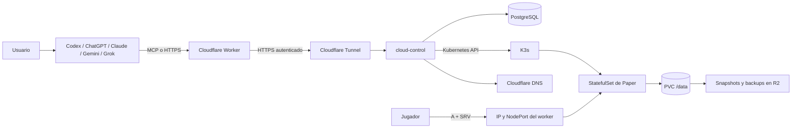
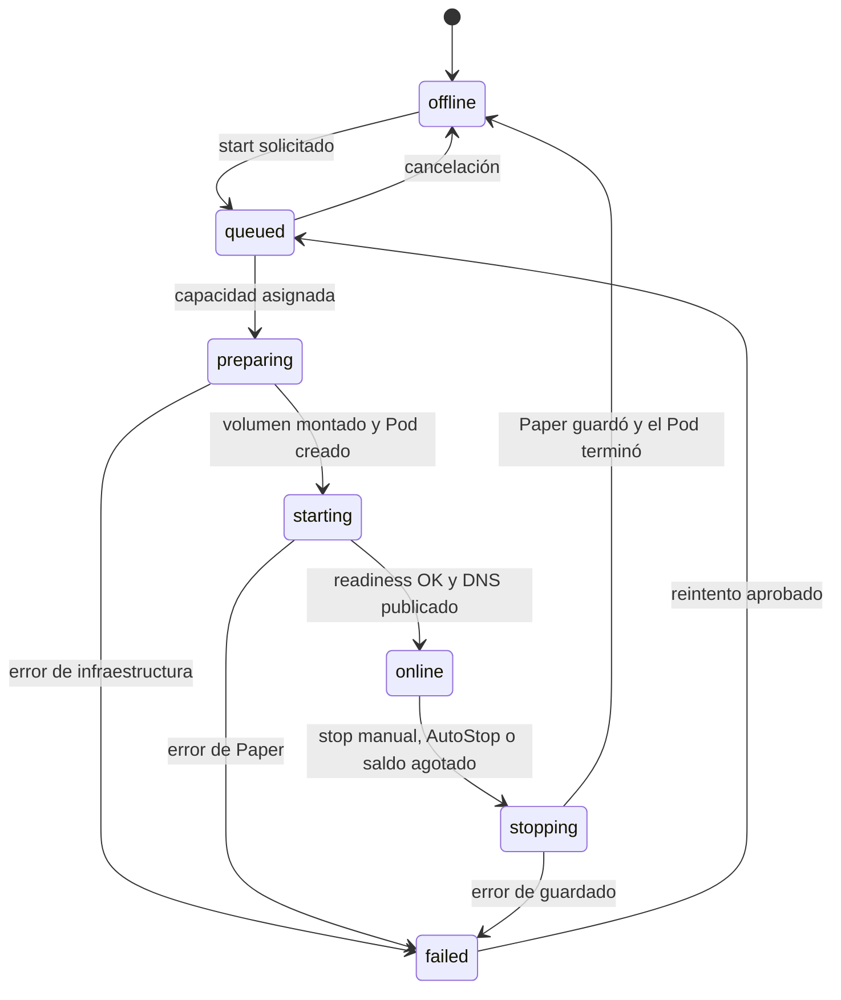
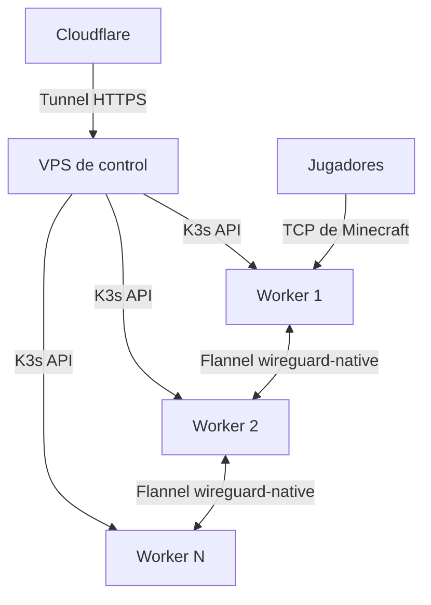
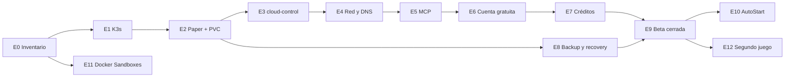

# Cloud: plan técnico de ejecución

Producto: `cloud.example.com`  
Promesa: Infrastructure in one prompt  
Primera entrega: servidores de Minecraft Java administrados desde un agente  
Fecha de referencia: 2 de septiembre de 2026

Una persona pide un servidor desde Codex, ChatGPT, Claude, Gemini, Grok o la web de Cloud. Recibe una dirección, juega y vuelve a encontrar el mismo mundo la próxima vez. Cloud se ocupa de la cuenta, la cola, el arranque, el apagado, el almacenamiento y el cobro.

El primer producto reproduce el modelo público de Aternos para la cuenta gratuita y el de exaroton para el uso pago. La infraestructura propia conserva ese comportamiento y reemplaza el panel por un contrato que pueden usar la web y los agentes.

## 1. Qué vamos a construir

Cloud tendrá tres líneas de producto. Comparten cuenta, créditos, API, permisos y registro de actividad. Cada una usa el runtime adecuado para su carga.

| Línea | Lo que pide el usuario | Lo que recibe | Runtime |
|---|---|---|---|
| **Host** | "Creame un Minecraft Paper para cuatro amigos" | Un servidor de juego con dirección y mundo persistentes | K3s y contenedores preparados |
| **Deploy** | "Publicá este n8n" | Un servicio persistente accesible por URL | Docker Sandbox sobre un host con KVM |
| **Continue** | "Dame un Codex en la nube y conservá la sesión" | Un entorno persistente para un agente | Docker Sandbox sobre un host con KVM |

Host sale primero con una sola receta: Minecraft Java + Paper. Esa receta permite probar el ciclo que después compartirán todos los productos: crear, asignar recursos, iniciar, publicar, medir, detener, guardar y restaurar.

### La experiencia completa

1. El usuario crea su cuenta de Cloud y conecta su agente.
2. Escribe: "Creame un servidor de Minecraft Paper llamado demo y prendelo".
3. El agente traduce el pedido y llama a una herramienta MCP con datos tipados.
4. Cloud crea el servidor lógico, reserva su nombre y registra el inicio.
5. La cuenta gratuita entra a la cola. La cuenta paga usa capacidad reservada.
6. Kubernetes inicia Paper y monta el volumen del mundo.
7. Cloud publica la dirección estable `demo.mc.cloud.example.com`.
8. El usuario y sus amigos se conectan directamente a esa dirección.
9. Cuando el servidor queda vacío durante el tiempo configurado, Cloud lo guarda y lo apaga.
10. El próximo inicio monta el mismo volumen y conserva el mundo, la configuración, los plugins y la lista de jugadores.

Un servidor existe aunque Paper esté apagado. En la base de datos mantiene su dueño, nombre, plan, versión, dirección y estado. En Kubernetes mantiene su definición y su volumen. El contenedor sólo existe mientras el servidor está arrancando, online o guardando.

## 2. El modelo comercial

### Cuenta gratuita: el modelo de Aternos

La cuenta gratuita usa capacidad ociosa y sigue estas reglas:

- una cuota inicial de un servidor de Minecraft Java por cuenta, ampliable cuando el costo de almacenamiento esté medido;
- un perfil fijo de CPU y RAM, definido por los benchmarks de la primera imagen;
- cola por orden de llegada, con posición y tiempo estimado;
- confirmación cuando llega el turno, para asignar recursos a una persona que sigue esperando;
- ejecución mientras haya jugadores conectados;
- apagado automático cuando el servidor queda vacío;
- hasta 4 GB entre mundo, configuración y plugins;
- aviso y eliminación después de unos 90 días sin uso;
- página de espera y estado preparada para publicidad cuando el tráfico la justifique.

Aternos financia su servicio gratuito con publicidad. En Cloud, el inicio desde un agente devuelve una URL de confirmación y seguimiento. Esa página muestra la cola, el estado del arranque y, cuando exista volumen de usuarios, los anuncios que sostienen la cuenta gratuita.

El prompt inicia el trámite. La confirmación reserva la capacidad cuando llega el turno. El usuario pago completa el mismo inicio desde el agente, sin pasar por la página de espera.

### Cuenta paga: el modelo de exaroton

La cuenta paga usa créditos prepagos y cobra sólo el tiempo de ejecución:

- precio expresado por GB de RAM y hora;
- cálculo por segundo entre `preparing` y el final de `stopping`;
- elección de perfiles de RAM;
- prioridad sobre la cola gratuita y una reserva de capacidad para inicios pagos;
- AutoStart al intentar entrar;
- AutoStop configurable;
- hasta 10 GB de almacenamiento por servidor, cobrado por períodos de 30 días;
- backups, acceso compartido y API.

La referencia comercial de exaroton es `1 crédito = EUR 0,01` y `1 crédito por GB de RAM por hora`, con RAM configurable entre 2 y 16 GB. Su almacenamiento cuesta hasta 10 créditos por cada 30 días y descuenta de esa tarifa los créditos consumidos mientras el servidor estuvo encendido. Cloud implementará esa misma unidad de consumo y compensación. El valor de venta del crédito sale del benchmark de cómputo, almacenamiento, tráfico protegido, comisiones de cobro e impuestos.

El ledger registra cada movimiento como un asiento inmutable: compra, consumo, ajuste o devolución. El saldo visible se calcula a partir de esos asientos. Un reintento de webhook o de API conserva el mismo resultado mediante una clave de idempotencia.

### Reparto de capacidad

La capacidad paga se reserva antes de abrir cupos gratuitos. La cola gratuita consume el resto.

```text
RAM utilizable = RAM allocatable de los workers - reserva del sistema
RAM paga       = reserva comercial
RAM gratuita   = RAM utilizable - RAM paga - cargas pagas activas
```

La documentación existente menciona siete VPS en Santiago, 168 GB totales y 144 GB de RAM en seis workers. La estimación más reciente es "casi 200 GB". El primer epic mide los hosts y deja un único inventario verificado. Esos datos fijan la capacidad simultánea que Cloud publicará.

## 3. Arquitectura



Hay dos recorridos de red:

- **Control:** cuenta, MCP, API, cola, estado y cobro viajan por HTTPS. Cloudflare Worker recibe la petición y Cloudflare Tunnel la lleva al VPS de control mediante una conexión saliente.
- **Juego:** Minecraft usa TCP contra el worker que ejecuta Paper. Un registro A publica la IP del worker y un registro SRV publica el puerto.

### Componentes

| Componente | Trabajo concreto |
|---|---|
| **Cloudflare Worker** | Valida tamaño, JWT y rate limit; exige idempotencia en operaciones mutables; añade un request ID; reenvía la petición al origen |
| **Cloudflare Tunnel** | Publica el origen HTTP sin abrir un puerto de entrada en el VPS de control |
| **cloud-control** | Sirve REST y MCP, aplica reglas de negocio, administra la cola y reconcilia PostgreSQL con Kubernetes |
| **PostgreSQL** | Guarda cuentas, servidores, ejecuciones, cola, créditos, backups, permisos e idempotencia |
| **K3s** | Programa Paper en los workers y aplica recursos, red, health checks y volúmenes |
| **Longhorn** | Mantiene el volumen activo replicado entre workers y permite volver a adjuntarlo en otro nodo |
| **R2** | Conserva backups fuera del cluster |
| **Cloudflare DNS** | Mantiene una dirección estable aunque cambien el worker y el puerto |

`cloud-control` empieza como un solo servicio TypeScript. Dentro del mismo proceso corren el servidor HTTP, el endpoint MCP y un reconciliador. PostgreSQL resuelve la cola inicial con transacciones y bloqueo de filas.

El origen del Tunnel vive en `control-origin.cloud.example.com` y queda protegido por Cloudflare Access. El Worker presenta un service token al reenviar. La dirección pública `api.cloud.example.com` termina en el Worker, por lo que el origen conserva una sola entrada autenticada.

## 4. Cómo vive un servidor de Minecraft

Cada servidor lógico tiene estos recursos:

- una fila en `servers`;
- un `StatefulSet` con `replicas: 0` cuando está apagado y `replicas: 1` cuando está encendido;
- un PVC propio montado en `/data`;
- un `Service` interno para estado y administración;
- un `Service` de tipo `NodePort` mientras está online;
- registros A y SRV bajo `mc.cloud.example.com`;
- backups identificados en PostgreSQL y almacenados en R2.

La imagen inicial será [`itzg/minecraft-server`](https://github.com/itzg/docker-minecraft-server), fijada por digest. La configuración inicial usa Paper, una versión exacta de Minecraft y la aceptación de la EULA. La imagen ya define `/data` como directorio persistente, incluye `mc-monitor` para health checks y usa `mc-server-runner` para terminar Minecraft de forma ordenada.

El PVC contiene el mundo, `server.properties`, plugins y demás archivos del servidor. Una actualización de imagen cambia el runtime y conserva `/data`.

### Estados



PostgreSQL guarda el estado deseado. Kubernetes informa el estado observado. El reconciliador compara ambos y repite operaciones seguras hasta que coincidan. Cada transición deja un evento con servidor, ejecución, motivo y request ID.

### Crear

`minecraft_server_create` valida el nombre, comprueba la cuota, crea la fila del servidor y reserva la dirección. También crea el `StatefulSet` apagado y el PVC. La respuesta llega sin esperar el arranque.

```json
{
  "server_id": "srv_7f31",
  "name": "demo",
  "address": "demo.mc.cloud.example.com",
  "status": "offline"
}
```

El argumento `start: true` encadena el inicio dentro del mismo pedido del agente.

### Poner en cola y asignar

`minecraft_server_start` inserta una fila en `start_queue`. El scheduler de `cloud-control` toma trabajos con una transacción `FOR UPDATE SKIP LOCKED`, primero por plan y después por antigüedad.

Antes de admitir un inicio, consulta los recursos solicitados y el margen reservado. Al admitirlo:

1. fija el perfil de CPU y RAM en el `StatefulSet`;
2. cambia `replicas` de 0 a 1;
3. espera que Kubernetes programe el Pod y monte el PVC;
4. observa la startup probe hasta que Paper termine de cargar;
5. crea el `NodePort` y obtiene el worker elegido;
6. actualiza A y SRV;
7. marca la ejecución `online`.

La cola de producto vive en PostgreSQL porque necesita prioridad paga, posición, estimación y confirmación. El scheduler de Kubernetes decide en qué worker cabe el Pod admitido.

### Conectar

El usuario conserva esta dirección:

```text
demo.mc.cloud.example.com
```

Cloud publica:

```text
A     demo.mc.cloud.example.com                 -> IP pública del worker
SRV   _minecraft._tcp.demo.mc.cloud.example.com -> NodePort asignado
```

El `Service` usa `externalTrafficPolicy: Local`. El tráfico entra por el worker donde vive el Pod y llega a Paper sin cruzar otro worker. Los registros usan un TTL corto. La respuesta de inicio incluye además `worker-host:puerto` como dirección de respaldo para resolvers con una entrada anterior en caché.

Los registros de Minecraft usan `DNS only`. El Worker y el Tunnel atienden el control HTTPS. El epic de red pública termina con una ruta L4 protegida y medida: protección del proveedor para la beta cerrada o Cloudflare Spectrum para la apertura pública, según costo y tráfico reales.

### Apagar

El AutoStop consulta el número de jugadores mediante `mc-monitor`. Cuando permanece en cero durante el plazo configurado, `cloud-control` cambia el estado deseado a `offline` y escala el `StatefulSet` a cero.

Kubernetes envía `SIGTERM`. `mc-server-runner` ordena a Paper guardar y salir. `cloud-control` espera la terminación correcta, toma un snapshot del volumen, registra el consumo y libera el NodePort. El PVC permanece montable para el próximo inicio.

Una detención manual, el AutoStop y el fin de saldo recorren la misma función. Así existe una sola ruta de guardado y facturación.

En cuentas pagas, el medidor empieza al pasar de `queued` a `preparing` y termina cuando el Pod completa `stopping`. Cada muestra acumula `RAM asignada × segundos` en `server_runs`; el cierre inserta el asiento definitivo en `credit_ledger`.

### Configurar, instalar y cambiar de versión

Las opciones editables tienen un esquema por receta. Para Paper, el esquema inicial cubre versión, dificultad, modo de juego, slots, whitelist, view distance y operadores. `cloud-control` valida el cambio, lo escribe en la configuración del servidor y reinicia Paper cuando la opción lo exige.

Los plugins y modpacks salen de un catálogo aprobado. El agente envía el identificador y la versión de Modrinth, CurseForge u otra fuente integrada. Un Job de instalación descarga el archivo, comprueba tamaño y checksum, lo escribe en el PVC y registra el cambio. La cuenta ve el error exacto si el addon no corresponde a la versión o al loader elegido.

El upload de un mundo crea un volumen nuevo. Cloud valida el archivo, lo abre con la receta elegida y cambia el PVC activo cuando Paper llega a ready. El volumen anterior queda disponible hasta terminar el backup.

## 5. Persistencia, backups y recuperación

La primera prueba corre en un worker con el provisionador local de K3s. Antes de admitir un segundo worker, el cluster incorpora Longhorn y repite la prueba con el volumen moviéndose entre nodos.

Configuración de beta:

- dos réplicas Longhorn en workers distintos de la misma región;
- anti-affinity entre réplicas;
- snapshot al terminar una ejecución;
- backup a R2 después de un stop correcto y una vez por día para servidores activos;
- retención corta para la cuenta gratuita y configurable para la paga;
- restauración siempre hacia un volumen nuevo, seguida de un cambio explícito de versión activa.

Longhorn requiere `open-iscsi` en cada worker. Su benchmark mide latencia de escritura, red entre nodos, tiempo de attach y efecto sobre TPS durante generación de chunks. La beta multiworker abre cuando Paper mantiene 20 TPS en el perfil publicado y el volumen puede volver a adjuntarse después de perder un worker.

Objetivos de recuperación para la beta:

| Evento | Resultado esperado |
|---|---|
| Stop normal | El siguiente inicio ve todos los cambios guardados antes de la confirmación de apagado |
| Reinicio de Paper | Kubernetes vuelve a crear el Pod sobre el mismo PVC |
| Caída de un worker | El servidor arranca en otro worker con el volumen replicado en menos de 15 minutos |
| Corrupción o borrado del mundo | Un operador restaura un backup probado desde R2 |
| Caída del control plane | Los servidores online siguen ejecutándose; la API vuelve con el VPS de control |

La prueba de restore forma parte del release. Un objeto presente en R2 cuenta como backup recién cuando una restauración automatizada crea un mundo que Paper puede abrir.

## 6. Red física de los VPS

La topología inicial usa un K3s server y varios agentes K3s:



El VPS de control ejecuta K3s server, PostgreSQL, `cloud-control` y `cloudflared`. Lleva un taint para reservarlo al control plane. Los demás VPS ejecutan K3s agent, Longhorn y servidores de juego.

Cada worker declara:

- IP pública;
- región y proveedor;
- RAM y CPU allocatable;
- almacenamiento disponible;
- capacidad para recibir tráfico de juego;
- dominio de falla para las réplicas.

Puertos de infraestructura:

| Puerto | Origen permitido | Uso |
|---|---|---|
| `6443/tcp` | Workers y administradores | API de K3s |
| `51820/udp` | Nodos del cluster | Flannel `wireguard-native` |
| `10250/tcp` | Nodos del cluster | Kubelet y métricas |
| Rango NodePort TCP | Internet durante la beta | Minecraft Java |
| `22/tcp` | IPs administrativas | SSH |

RCON, PostgreSQL, métricas y la API interna permanecen en la red del cluster. Las reglas del proveedor y del host se generan a partir de esta tabla y se prueban desde fuera de la red.

## 7. Control plane, datos y contratos

### Tablas iniciales

| Tabla | Datos principales |
|---|---|
| `accounts` | identidad, plan y estado |
| `servers` | dueño, nombre, receta, versión, perfil, dirección y estado deseado |
| `server_runs` | inicio, fin, recursos asignados, nodo, consumo y resultado |
| `start_queue` | posición, prioridad, confirmación, vencimiento y motivo de espera |
| `credit_accounts` | moneda de crédito y saldo materializado |
| `credit_ledger` | compra, uso, ajuste o devolución con referencia idempotente |
| `backups` | servidor, objeto R2, checksum, tamaño, fecha y resultado de restore |
| `access_grants` | usuario invitado y permisos sobre un servidor |
| `idempotency_keys` | actor, operación, hash del pedido y respuesta original |
| `audit_events` | actor, acción, objetivo, resultado y request ID |

`servers.status` es una vista útil para el producto. `server_runs` y `audit_events` conservan la historia. El saldo cambia dentro de la misma transacción que inserta el asiento del ledger.

### API y MCP

El agente interpreta el lenguaje natural. REST y MCP entregan operaciones y argumentos concretos al mismo código de aplicación.

Herramientas iniciales:

```text
minecraft_server_create(name, version, plan, start)
minecraft_server_start(server_id)
minecraft_server_status(server_id)
minecraft_server_stop(server_id)
minecraft_server_configure(server_id, options)
minecraft_server_set_software(server_id, software, version)
minecraft_server_install_addon(server_id, source, addon_id, version)
minecraft_server_remove_addon(server_id, addon_id)
minecraft_server_upload_world(server_id, upload_id)
minecraft_server_backup(server_id)
minecraft_server_restore(server_id, backup_id)
minecraft_server_share(server_id, user, permissions)
billing_balance()
```

Ejemplo de llamada producida por un agente:

```json
{
  "name": "demo",
  "version": "1.21.8",
  "plan": "free",
  "start": true
}
```

Ejemplo de respuesta durante la cola:

```json
{
  "server_id": "srv_7f31",
  "status": "queued",
  "position": 4,
  "estimated_wait_seconds": 180,
  "confirmation_url": "https://cloud.example.com/q/q_92ad"
}
```

El endpoint remoto MCP usa Streamable HTTP sobre HTTPS y bearer tokens durante la beta cerrada. La apertura pública agrega OAuth 2.1 con PKCE, discovery y refresh tokens para los clientes que los admiten.

| Cliente | Integración de Cloud |
|---|---|
| **Codex** | Servidor MCP remoto configurado por URL; primer cliente de aceptación |
| **Claude y Claude Code** | Conector MCP remoto con bearer u OAuth |
| **Gemini** | Servidor MCP remoto desde Agents API, Antigravity o un cliente construido con el SDK |
| **ChatGPT** | App MCP con acciones de escritura para Business, Enterprise y Edu; la web de Cloud cubre las cuentas de consumo durante la beta |
| **Grok** | Funciones tipadas de xAI que llaman al contrato REST de Cloud |
| **Web de Cloud** | Chat propio que ejecuta las mismas funciones tipadas contra REST |

OpenAI Responses, Claude y Gemini admiten herramientas MCP remotas. ChatGPT ofrece las acciones MCP completas en beta para Business, Enterprise y Edu a la fecha de este documento. xAI ofrece function calling; su adaptador llama a REST y deja la lógica en `cloud-control`. El backend recibe el mismo objeto sin importar qué modelo produjo la llamada.

Las operaciones que cambian estado aceptan `Idempotency-Key`. Repetir `create`, `start`, `stop`, una compra o un webhook devuelve el resultado ya registrado.

## 8. Cuenta gratuita, cola y página de espera

Un inicio gratuito crea una entrada FIFO. La respuesta del agente muestra posición, estimación y URL. El backend actualiza esa página mediante Server-Sent Events.

Cuando el pedido llega al frente:

1. la página pide confirmación;
2. la reserva dura un plazo corto;
3. la confirmación cambia el pedido a `ready`;
4. el scheduler asigna capacidad;
5. la página muestra preparación, arranque y dirección final.

La estimación usa datos observados: duración de ejecuciones, ritmo de liberación de RAM y pedidos delante. Se presenta como rango y se recalcula. La posición es el dato exacto.

La política de inactividad corre una vez por día. A los servidores cercanos al límite les envía aviso por correo y por el próximo `status`. Cumplido el plazo, crea un backup final, espera el período de gracia y libera el volumen.

La página de espera debe poder alojar publicidad sin mezclar scripts publicitarios con credenciales del usuario. El estado público usa un token opaco de alcance limitado; los cambios de cuenta vuelven a exigir sesión.

## 9. Medición y operación

### Benchmark de la receta Paper

El benchmark fija el perfil gratuito y los perfiles pagos. Usa la misma imagen, versión, flags y view distance que producción.

Se mide:

- RAM después del arranque y con 1, 2, 4 y 8 jugadores;
- CPU y TPS durante generación de chunks, movimiento y combate;
- tiempo desde admisión hasta readiness, con imagen fría y caliente;
- tamaño de un mundo nuevo y crecimiento después de sesiones repetibles;
- escritura y latencia del PVC con una y dos réplicas;
- tráfico de red por jugador;
- duración de stop, snapshot, backup y restore para 100 MB, 500 MB, 1 GB y 4 GB;
- densidad estable por worker con margen para el sistema.

El resultado produce tres artefactos versionados:

```text
benchmarks/paper/<version>/raw.json
benchmarks/paper/<version>/report.md
catalog/minecraft-paper.yaml
```

El catálogo contiene requests, limits, máximo de jugadores, máximo de almacenamiento, tiempo de AutoStop y precio por segundo. Cambiar un perfil exige volver a ejecutar el benchmark.

### Métricas de producción

El tablero operativo necesita estas series:

- RAM, CPU, disco, red y TPS por ejecución;
- servidores en cada estado;
- espera p50, p95 y máxima por plan;
- tiempo de arranque p50 y p95;
- errores de mount, Paper, DNS, stop, snapshot y restore;
- jugadores simultáneos y duración de sesiones;
- RAM reservada, paga, gratuita y libre por worker;
- créditos comprados, consumidos, ajustados y reembolsados;
- intervenciones manuales por cada cien ejecuciones.

Alertas iniciales:

- worker sin responder;
- volumen degradado;
- backup vencido o restore fallido;
- servidor atascado en una transición;
- discrepancia entre ledger y saldo;
- capacidad paga por debajo de la reserva;
- error sostenido del Tunnel o de la API.

## 10. Cómo se agrega el siguiente juego

Minecraft queda implementado de forma explícita en el primer release. Al agregar el segundo juego, Cloud extrae de Minecraft y de esa nueva implementación un formato común de receta.

Cada receta declara:

| Campo | Ejemplo de Minecraft |
|---|---|
| imagen y digest | `itzg/minecraft-server@sha256:...` |
| protocolo público | TCP |
| puertos | `25565` dentro del contenedor, NodePort fuera |
| directorio persistente | `/data` |
| comando de inicio | definido por la imagen |
| health check | `mc-monitor status` |
| consulta de jugadores | `mc-monitor` |
| secuencia de stop | `mc-server-runner` y `SIGTERM` |
| perfiles | free, 2 GB, 4 GB, 8 GB y 16 GB después del benchmark |
| opciones editables | versión, dificultad, whitelist, view distance y plugins aprobados |
| soporte de backup | snapshot del PVC y backup R2 |

El segundo juego debe completar el mismo contrato: crear, iniciar, publicar, medir jugadores, detener, guardar y restaurar. Sus diferencias quedan dentro de la receta y de un adaptador corto. Cuenta, cola, créditos, DNS, backups y auditoría siguen en `cloud-control`.

## 11. Seguridad

El Worker valida el límite de petición, el token y el rate limit. `cloud-control` vuelve a validar identidad, propiedad, plan y estado dentro de la transacción que registra la operación.

Durante la beta, Cloud emite un JWT corto con `account_id`, scopes y vencimiento. El Worker verifica la firma con una clave pública y `cloud-control` repite la verificación antes de consultar la cuenta. OAuth reemplaza la emisión manual al abrir el registro público.

La receta Paper aplica:

- imagen fijada por digest;
- usuario sin privilegios;
- filesystem raíz de sólo lectura cuando la imagen lo permita;
- PVC montado únicamente en `/data`;
- requests y limits de CPU, RAM y almacenamiento;
- NetworkPolicy para RCON, health checks y salida necesaria;
- ServiceAccount sin permisos sobre la API de Kubernetes;
- secretos entregados como Secret y montados fuera del mundo;
- catálogo cerrado de versiones, loaders y plugins durante la beta.

`cloud-control` usa un ServiceAccount limitado al namespace `games` y a los tipos de recurso que reconcilia. Las credenciales de Cloudflare, R2 y pagos viven separadas y se rotan. Cada acción administrativa queda en `audit_events`.

Uploads y restores se escriben en un volumen nuevo, se validan con Paper y recién entonces reemplazan la versión activa. El límite de tamaño se aplica antes y durante la carga.

## 12. Orden de construcción y epics para Linear

El orden siguiente llega a una partida real temprano y agrega el modelo comercial sobre un ciclo ya probado.



### E0. Inventario y capacidad base

Este epic entrega un inventario verificado de los VPS y un perfil Paper medido.

Features:

- inventario de CPU, RAM, disco, red, IP, región, proveedor y virtualización;
- benchmark Paper repetible;
- presupuesto de capacidad gratuita y paga.

Terminado cuando:

- cada VPS aparece en un inventario versionado;
- el benchmark se puede repetir con un comando;
- `catalog/minecraft-paper.yaml` contiene recursos derivados de los resultados;
- la estimación de servidores simultáneos incluye reserva del sistema y capacidad paga.

### E1. Cluster K3s

El VPS de control queda listo para programar cargas en los workers.

Features:

- K3s server en control y agentes en workers;
- Flannel `wireguard-native`, firewall y etiquetas de nodo;
- namespaces, RBAC, quotas y taint del control plane;
- Longhorn con dos réplicas antes del segundo worker productivo.

Terminado cuando:

- un Pod de prueba se programa en cada worker;
- la red entre Pods funciona cifrada;
- un PVC se mueve entre dos workers conservando sus datos;
- las reglas externas exponen sólo los puertos documentados.

### E2. Runtime de Minecraft

Paper enciende y apaga sobre un volumen persistente.

Features:

- imagen fijada y receta Paper;
- StatefulSet 0/1, PVC `/data`, probes y stop ordenado;
- configuración por perfil;
- AutoStop basado en jugadores conectados.

Terminado cuando:

- veinte ciclos de start, cambio de mundo, stop y start conservan el cambio;
- una señal de terminación produce un stop limpio;
- Paper mantiene los límites del perfil medido;
- el Pod queda en cero después del plazo sin jugadores.

### E3. `cloud-control` y PostgreSQL

La API maneja el ciclo completo y conserva su estado.

Features:

- migraciones y tablas iniciales;
- create, start, status y stop;
- reconciliador Kubernetes;
- idempotencia y auditoría.

Terminado cuando:

- repetir una petición con la misma clave conserva un solo efecto;
- reiniciar `cloud-control` reanuda las transiciones pendientes;
- el estado de API coincide con Kubernetes después de una reconciliación;
- cada transición tiene un evento trazable.

### E4. Dirección estable y borde Cloudflare

La API y cada servidor quedan disponibles mediante una dirección pública estable.

Features:

- Worker público y origen por Tunnel;
- Access service token entre Worker y origen;
- A, SRV, NodePort y dirección de respaldo;
- prueba y elección de la ruta L4 protegida.

Terminado cuando:

- la API sólo responde a pedidos que pasan por el Worker;
- el mismo dominio conecta a un servidor iniciado en dos workers diferentes;
- un cambio de nodo actualiza DNS y devuelve el fallback correcto;
- la ruta pública tiene tráfico, latencia, costo y protección DDoS medidos.

### E5. Integración con agentes

Un prompt ejecutado en un cliente compatible crea y administra un servidor.

Features:

- endpoint MCP remoto;
- bearer token para beta y flujo de vinculación documentado;
- herramientas Minecraft y respuestas tipadas;
- ejemplo REST para clientes sin MCP.

Terminado cuando:

- Codex completa create, start, status y stop desde una conversación;
- un segundo cliente completa el mismo flujo;
- los errores devuelven estado, causa accionable y request ID;
- el agente usa solamente un token de Cloud con alcance de usuario.

### E6. Producto gratuito

Una persona externa puede usar el flujo Aternos completo.

Features:

- cuota por cuenta y perfil gratuito;
- cola FIFO, posición, estimación, confirmación y vencimiento;
- página de espera por SSE;
- límite de almacenamiento e inactividad;
- opciones, catálogo de addons y upload de mundo.

Terminado cuando:

- diez usuarios compiten por capacidad sin saltear el orden confirmado;
- cancelar o vencer una reserva libera el turno;
- el servidor corre mientras tiene jugadores y se apaga al quedar vacío;
- el aviso de inactividad y la eliminación con backup final están probados.

### E7. Créditos y producto pago

Cada ejecución paga descuenta el consumo exacto y obtiene prioridad.

Features:

- compra de paquetes de créditos;
- ledger, saldo e idempotencia de webhooks;
- medición por GB-segundo;
- perfiles de RAM, almacenamiento y reserva paga.

Terminado cuando:

- una ejecución conocida produce el cargo esperado al centavo de crédito;
- un webhook repetido registra una sola compra;
- el sistema detiene de forma ordenada una ejecución que agota su saldo;
- la carga paga entra usando la reserva aunque la cola gratuita esté llena.

### E8. Backups y recuperación

El equipo puede recuperar un servidor después de un error de aplicación o de nodo.

Features:

- snapshots Longhorn;
- backups R2 con checksum y retención;
- restore hacia volumen nuevo;
- runbook para pérdida de worker y corrupción.

Terminado cuando:

- cada escenario de la tabla de recuperación tiene una prueba registrada;
- un backup elegido al azar restaura un mundo arrancable;
- perder un worker cumple el objetivo de 15 minutos;
- la cuenta muestra fecha y resultado del último backup probado.

### E9. Operación y beta cerrada

Usuarios externos pueden jugar sin acceso de administrador.

Features:

- métricas, logs, alertas y panel operativo;
- límites por cuenta y rate limits;
- soporte con request ID;
- prueba de carga y runbooks.

Terminado cuando:

- una beta de dos semanas completa al menos cien ejecuciones;
- el equipo conoce p95 de cola, arranque, stop y restore;
- cada alerta crítica tiene dueño y runbook;
- las intervenciones manuales y pérdidas de datos están registradas.

### E10. AutoStart pago

Intentar entrar a un servidor pago apagado inicia Paper.

Features:

- listener del protocolo de Minecraft para dominios de Cloud;
- inicio autenticado por dirección y plan;
- pantalla de espera durante el arranque;
- transferencia o reconexión al servidor listo.

Terminado cuando:

- una conexión a un servidor offline crea una sola solicitud de inicio;
- varios intentos simultáneos se deduplican;
- el jugador llega al servidor correcto cuando Paper queda online;
- tiempo, tráfico y fallos quedan medidos.

### E11. Prueba de Docker Sandboxes

Un host real confirma la base técnica de Deploy y Continue.

Docker Sandboxes ejecuta cada carga dentro de una microVM con kernel y Docker Engine propios. El usuario puede usar `sudo` dentro de ese entorno. El host necesita Ubuntu 24.04 o posterior y KVM o virtualización anidada.

Features:

- diagnóstico de KVM en un VPS;
- sandbox de n8n con datos persistentes y URL pública;
- sandbox de Codex con login, sesión, stop y resume;
- medición de RAM, CPU, disco, red y tiempo de inicio.

Terminado cuando:

- n8n conserva un workflow después de stop y resume;
- Codex conserva autenticación y sesión según el mecanismo soportado;
- `sudo` funciona dentro de la microVM y el host queda fuera de su alcance;
- el sandbox monta sólo el workspace asignado y publica únicamente los puertos declarados.

Este epic valida la tecnología. Sus resultados definen los epics de producto de Deploy y Continue.

### E12. Segundo juego y formato de recetas

Host incorpora un segundo juego sin duplicar la cuenta, la cola, el cobro ni la operación.

Features:

- elección del segundo juego a partir de demanda y disponibilidad de una imagen mantenida;
- benchmark de CPU, RAM, disco, red y tiempo de arranque;
- receta con puertos, persistencia, health check y stop;
- herramientas MCP que aceptan el tipo de juego.

Terminado cuando:

- el segundo juego completa veinte ciclos de start y stop conservando sus datos;
- la misma cola programa Minecraft y el nuevo juego;
- el ledger calcula ambos consumos con sus perfiles;
- agregar una tercera receta exige datos y comandos del juego, no cambios en cuenta, cola o facturación.

## 13. Primer corte demostrable

El primer corte cubre el ciclo de Minecraft con una sola persona y un solo worker.

1. Crear un servidor lógico por API.
2. Crear su StatefulSet y PVC.
3. Escalar a uno.
4. Esperar readiness.
5. Entrar por IP y NodePort.
6. Colocar un bloque identificable en el mundo.
7. Ejecutar stop y escalar a cero.
8. Volver a escalar a uno.
9. Verificar el bloque.
10. Repetir veinte veces.

Después se agrega, en este orden: segundo worker y Longhorn; DNS estable; Cloudflare Worker y Tunnel; MCP; cola gratuita; créditos; AutoStart.

### Tickets del primer corte

Esta tabla se puede copiar a Linear. Cada fila es un ticket y cada criterio de cierre se prueba en el entorno del ticket.

| Ticket | Trabajo | Criterio de cierre |
|---|---|---|
| `HOST-001` | Inventariar el VPS de control y el primer worker | JSON versionado con CPU, RAM, disco, red, IP, SO y KVM |
| `HOST-002` | Instalar K3s server y unir el worker | Ambos nodos figuran `Ready`; el control tiene su taint |
| `HOST-003` | Crear namespace `games` y RBAC | Una cuenta de servicio de prueba puede administrar StatefulSets, Services y PVC sólo dentro de `games` |
| `HOST-004` | Fijar la imagen y la configuración Paper | El digest y la versión aparecen en una receta versionada; Paper llega a ready |
| `HOST-005` | Crear el PVC y montar `/data` | Un archivo escrito desde el Pod reaparece después de recrearlo |
| `HOST-006` | Definir probes y stop ordenado | Startup y readiness reflejan el estado real; `SIGTERM` termina con código correcto |
| `HOST-007` | Crear el esquema mínimo de PostgreSQL | Migración crea `accounts`, `servers`, `server_runs`, `idempotency_keys` y `audit_events` |
| `HOST-008` | Implementar `minecraft_server_create` | Crea una sola fila, un StatefulSet apagado y un PVC aunque se repita la clave |
| `HOST-009` | Implementar `minecraft_server_start` | Escala a uno, espera readiness y registra una ejecución |
| `HOST-010` | Implementar `minecraft_server_status` | Devuelve estado deseado, estado observado, nodo y tiempos |
| `HOST-011` | Implementar `minecraft_server_stop` | Escala a cero después del guardado y cierra `server_runs` |
| `HOST-012` | Publicar un NodePort de prueba | Un cliente externo entra al servidor por IP y puerto |
| `HOST-013` | Automatizar la prueba de persistencia | Veinte ciclos conservan el bloque de control y producen un reporte |
| `HOST-014` | Documentar arranque y recuperación | Una segunda persona ejecuta el runbook desde un cluster limpio |

## 14. Fuentes

Modelo Aternos y exaroton:

- [Aternos: crear un servidor](https://support.aternos.org/hc/en-us/articles/12165605063325-Creating-a-free-Minecraft-server-with-Aternos)
- [Aternos: conexión, dirección y DynIP](https://support.aternos.org/hc/en-us/articles/360026805072-Connect-to-your-server)
- [Aternos: cola](https://support.aternos.org/hc/en-us/articles/360026950812-Queue)
- [Aternos: apagado cuando no quedan jugadores](https://support.aternos.org/hc/en-us/articles/31771896948253-24-7-Hosting)
- [Aternos: límite de almacenamiento](https://support.aternos.org/hc/en-us/articles/360035144691-Maximum-allowed-server-size)
- [Aternos: eliminación por inactividad](https://support.aternos.org/hc/en-us/articles/360030845111)
- [Aternos GmbH: financiación por publicidad y exaroton](https://aternos.gmbh/en/)
- [exaroton: precio y almacenamiento](https://support.exaroton.com/hc/en-us/articles/360019687657-Pricing)
- [exaroton: cálculo de consumo](https://support.exaroton.com/hc/en-us/articles/360019857858-Transactions)
- [exaroton: AutoStart](https://support.exaroton.com/hc/en-us/articles/15338752897181-Start-your-server-automatically-when-a-player-tries-to-join)
- [exaroton: AutoStop](https://support.exaroton.com/hc/en-us/articles/360019687297-Stop-your-server-automatically-when-it-s-empty)
- [exaroton: API](https://developers.exaroton.com/)

Implementación:

- [K3s: opciones de red](https://docs.k3s.io/networking/basic-network-options)
- [K3s: requisitos y puertos](https://docs.k3s.io/installation/requirements#networking)
- [Longhorn: documentación](https://longhorn.io/docs/)
- [Longhorn sobre K3s](https://longhorn.io/docs/1.12.1/advanced-resources/os-distro-specific/csi-on-k3s/)
- [`itzg/minecraft-server`](https://github.com/itzg/docker-minecraft-server)
- [`mc-monitor`: estado, jugadores y métricas](https://github.com/itzg/mc-monitor)
- [`mc-server-runner`](https://github.com/itzg/mc-server-runner)
- [Cloudflare Tunnel](https://developers.cloudflare.com/cloudflare-one/networks/connectors/cloudflare-tunnel/)
- [Cloudflare Workers Rate Limiting](https://developers.cloudflare.com/workers/runtime-apis/bindings/rate-limit/)
- [Cloudflare: puertos publicados por el proxy](https://developers.cloudflare.com/fundamentals/reference/network-ports/)
- [OpenAI: MCP y conectores](https://developers.openai.com/api/docs/guides/tools-connectors-mcp)
- [OpenAI: apps MCP y modo desarrollador de ChatGPT](https://help.openai.com/en/articles/12584461)
- [Anthropic: MCP en Claude](https://docs.anthropic.com/en/docs/mcp)
- [Google: MCP remoto en Gemini Agents](https://ai.google.dev/api/agents)
- [xAI: function calling](https://docs.x.ai/developers/tools/function-calling)
- [Docker Sandboxes](https://docs.docker.com/ai/sandboxes/)
- [Docker Sandboxes: aislamiento](https://docs.docker.com/ai/sandboxes/security/isolation/)
- [Docker Sandboxes: requisitos](https://docs.docker.com/ai/sandboxes/install/)
