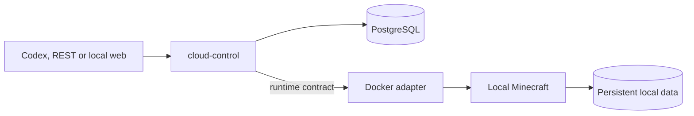
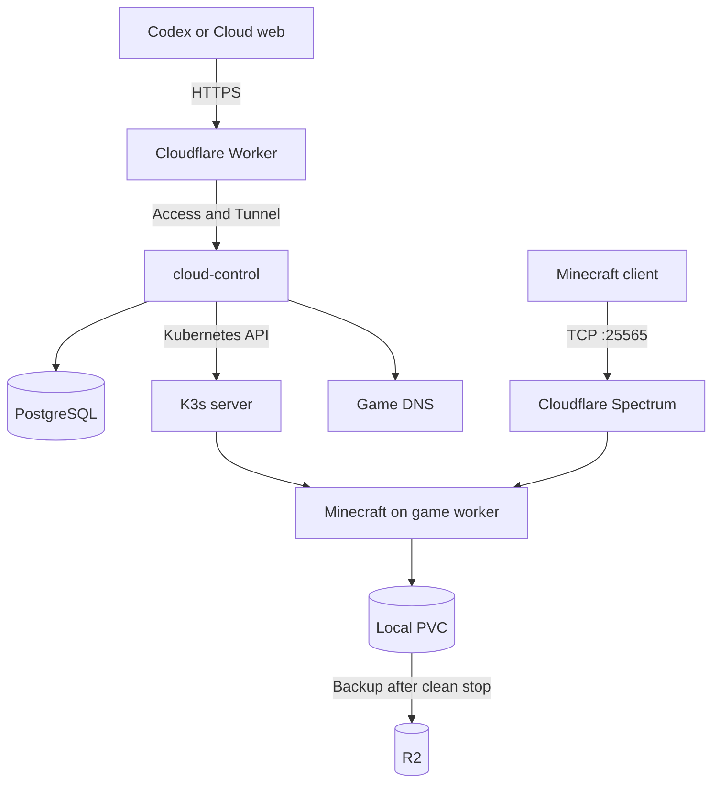

# Architecture

This is the selected design for Cloud's local product and the managed service built from it. It describes work to implement and verify. The [repository overview](../README.md) distinguishes the available tools and evidence from the planned product; [decisions](decisions.md) records changes to the design.

## Product boundaries

Host runs game servers. Deploy will run a curated application catalog. Both need accounts, permissions, resource admission, persistent data and an activity record. They do not necessarily need the same runtime or stopping policy.

Minecraft Java is the first Host workload. Its selected free profile is Paper 26.2 build 121, accepted for E1 with one active instance and two players on the tested Oracle A1 host. The [profile and evidence](../benchmarks/minecraft/free-profile-results.md) record the resources, bot activities and local recovery checks. Paid variants and other games follow their own qualification. Deploy starts with maintained application recipes; arbitrary user code remains a later stage. Continue, the agent-hosting product explored in earlier documents, is excluded.

The [catalog](../catalog/README.md) separates the product, its executable recipe, the tested resource profile, the evidence and the commercial offer. A recipe describes how to run a workload. A profile identifies exactly what was tested. An offer applies access, limits and pricing to a qualified profile. Adding an offer does not make an untested configuration supported.

## Delivery sequence and shared core

The first product gate is local. From a clean clone, `docker compose up --build` must start PostgreSQL and `cloud-control`; the control service then creates one persistent Minecraft server through Docker and completes `create → start → status → connect → stop` without VPS, Cloudflare, R2 or private credentials.

`cloud-control` starts as one TypeScript process in a Compose-managed container. Its durable model, REST operations, MCP tools, web flow and reconciler do not depend on Docker or Kubernetes types. A runtime contract owns `create`, `observe`, `start` and `stop` effects. After that contract is accepted, the Docker adapter and local interfaces can be developed in parallel.

The local container mounts `/var/run/docker.sock` read-write and creates the pinned Minecraft image as a sibling container with deterministic names, a project-owned named volume and host ports bound only to `127.0.0.1`. Socket access gives `cloud-control` control over the local Docker Engine. This is an explicit development-only trust boundary and is forbidden in the managed deployment. Kubernetes later implements the same runtime contract without this mount.

Local acceptance proves product behavior, persistence, idempotency and process recovery. The automated suite is a continuous Linux CI gate and the same suite is recorded from a clean clone with Docker Desktop on macOS. It does not promise multi-account isolation, remote backup, public availability or a supported production installation on third-party infrastructure.

## Managed path after local acceptance

The managed deployment reuses `cloud-control` and replaces the Docker adapter with a Kubernetes adapter. It adds public identity, admission, queueing, AutoStop and remote recovery around the accepted local behavior. PostgreSQL stores the requested state, queue and pending work so a restart can resume an operation.

The first topology has two roles:

| Role | Runs |
| --- | --- |
| `control-1` | K3s server, PostgreSQL, `cloud-control` and `cloudflared` |
| `game-1` | K3s agent, Minecraft and its local volumes |

Games stay off the control host. A temporary second game worker is required for the recovery exercise. Two hosts alone cannot prove recovery after losing the only game worker.

The diagram shows the intended public path. The Worker and Tunnel design covers the control API. [Cloudflare's proxy documentation](https://developers.cloudflare.com/fundamentals/reference/network-ports/) distinguishes its HTTP ports from other TCP services. Public Minecraft traffic will use a separate Spectrum application connected to the active worker's game port. [D5](decisions.md#d5-public-game-tcp-and-worker-ip-exposure-updated-2026-09-06) places Spectrum implementation and authenticated external-client validation after the functional invited beta, before public opening. E1 through E5 can use a controlled test path with its actual exposure recorded. Stable game addresses and HTTP protection remain part of E2.

If `control-1` fails, existing games can continue on healthy workers. New operations, queue processing and AutoStop wait for control recovery. This is the intended beta availability limit, subject to a restore drill.

## Identity, requests and runs

A logical server keeps its owner, hostname, recipe, profile and data while offline. A run is one admitted execution of that server. A stopped process does not delete the logical server or its world.

The first acceptance flow is `create → start → status → connect → stop` through the local REST, MCP and web interfaces. `CLOUD_MODE=local` bootstraps one development principal and reads `CLOUD_DEV_TOKEN`, defaulting to the non-secret `local-dev-token`. That default is valid only on loopback in local mode; managed configuration must reject it and must not bootstrap the local principal. The flow returns a loopback Minecraft address. Managed acceptance repeats the same contract with a beta account and stable public address. Clients receive no Kubernetes, Docker or VPS credentials.

For each mutation, the shared core validates the principal and arguments, then commits the intended state in PostgreSQL. The managed layer additionally validates ownership and quota. A reconciler applies the corresponding resources using stable identifiers and records what actually happened. External calls do not hold an open database transaction.

REST and MCP share a durable `client_request_id`. The same account, operation, key and body return the recorded result. Reusing the key with a different body returns a conflict. Transport request IDs do not substitute for this key. State constraints also enforce at most one active start request and one active run per logical server.

## Process and data lifecycle

The local Docker adapter and the managed Kubernetes adapter share lifecycle semantics: readiness means Minecraft accepts a protocol connection, and stop is complete only after the normal save-and-exit path finishes. Local data must survive both game and control-process restarts.

The selected managed Kubernetes design uses a `Deployment` with `Recreate` and zero or one replicas, plus an explicit PVC for `/data`. The PVC lives independently of the Deployment. The earlier StatefulSet design is superseded.

The first admitted start creates the PVC, then starts the pinned recipe. Readiness must mean that Minecraft accepts a connection. Normal starts reuse the local volume on its worker. Storage and compute limits come from the selected profile.

Manual stop and AutoStop use one path:

1. Store the requested offline state and scale the Deployment to zero.
2. Allow Minecraft to save and exit through its normal termination path.
3. Wait for termination before marking the run stopped or mounting its data for backup.
4. Upload a new backup generation to R2 and verify its size and checksum.

Run state and backup state remain separate. A server may be offline while its backup is pending or failed. A verified upload becomes a proven recovery copy only after a restore test opens and checks the restored world.

`Recreate` orders replacement during Deployment upgrades; it does not guarantee one writer after every kind of Pod deletion. `ReadWriteOnce` can also permit multiple Pods on the same node. The implementation must prevent another writer until the previous one has stopped. E1 must exercise interrupted stops and replacement. See [Deployment strategy](https://kubernetes.io/docs/concepts/workloads/controllers/deployment/#recreate-deployment) and [volume access modes](https://kubernetes.io/docs/concepts/storage/persistent-volumes/#access-modes).

E1's manifests ([catalog/games/minecraft-java/paper/k8s/](../catalog/games/minecraft-java/paper/k8s/)) propose layers meant to close this gap: `Recreate` with a 120s `terminationGracePeriodSeconds` matching the itzg image's SIGTERM save path; a PVC on a `local-path-retain` StorageClass (`Retain` reclaim policy, `WaitForFirstConsumer` binding), whose node affinity forces any replacement Pod onto the same node/filesystem instance and whose `Retain` policy means scaling to zero can never delete the world; Minecraft's own `session.lock` file as a backstop that crashes a racing second process instead of letting it write; a `hostPort` binding as an OS-level exclusion; and a dedicated `ServiceAccount` with no RoleBinding so a compromised container can't reach the Kubernetes API to force a second replica. **Pending validation:** this is a proposed mechanism, not yet exercised on real hosts — the runbook's six interrupted-stop/replacement scenarios must run against a live K3s cluster before this paragraph can be rewritten as a resolved risk.

Recovery starts by isolating the old worker. It restores into a new PVC on another worker, validates the data in Minecraft, updates the active volume and game endpoint, then closes the incident. An unreachable worker is not proof that it stopped writing.

The initial design uses local volumes and R2. It promises no automatic movement of a live local volume, zero data loss after worker failure or fixed recovery time. E4 must measure lost progress and recovery duration before the beta states those limits. Replicated storage is a separate decision if the measured result is unacceptable.

## Admission and operating policies

Free Minecraft uses one qualified resource profile. Admission accounts for CPU, RAM, disk pressure, reservations and host overhead. A queue is needed only when eligible capacity is unavailable. An existing local volume also restricts which worker can accept that start.

When a slot becomes available, the account confirms a reservation that expires after its configured window. Queue position and state survive a closed browser or chat. AutoStop waits for a measured empty server; a failed player-count query is an error, not zero players.

An application cannot inherit that policy without review:

| Workload | Recipe must define |
| --- | --- |
| Game server | Protocols, readiness, player detection, safe stop, world format and acceptable playing quality |
| Web application | HTTP readiness, background jobs, secrets, data dependencies and whether any idle stop is safe |
| Database or other persistent service | Consistent backup, restore verification and the availability required by its clients |

There is no generic rule to stop Deploy workloads after a period without HTTP requests. Runtime and isolation choices remain open until the first curated application has a concrete operating contract. Docker Sandboxes was a research candidate, not a selected Deploy dependency.

## Trust boundaries

The beta accepts maintained recipes and validated options. User-supplied images, commands, manifests, plugins and world uploads are outside that initial boundary. Each later capability needs its own input handling, resource limits and tests of isolation between accounts.

Workload processes run without host privileges or Kubernetes API credentials. `cloud-control` gets only the resource permissions it needs. RCON, PostgreSQL and cluster administration remain private. The infrastructure and recipe checks must verify these restrictions; their presence in this document is not evidence that they are deployed.

Local PVC capacity requests are not a substitute for an enforced filesystem quota. The beta design uses monitored storage thresholds and stops new admission before host exhaustion. Exact per-server disk limits need a tested enforcement mechanism before public registration.

## Evidence before an offer

Each [qualification](../catalog/README.md) identifies software versions, image digest, CPU architecture, host class, memory, CPU limits, disk, configuration and workload. It tests real actions and persistence as well as process health. A software version, loader or modpack can change both compatibility and cost.

Minecraft qualification compares candidates under equal conditions, then measures simultaneous instances with host overhead and spare capacity. TPS, chunk waits, disconnects, action delays and recovery each provide separate evidence. The owner accepted the repeated bot workload for E1 profile selection on 2026-09-06. Human play and the Spectrum route remain public-opening checks. The [results](../benchmarks/minecraft/free-profile-results.md) preserve the failed two-instance level and distinguish profile acceptance from a working managed service.

Clean-clone local acceptance comes before code publication and managed-service adaptation. A supported production installation by other operators remains a separate later delivery.
