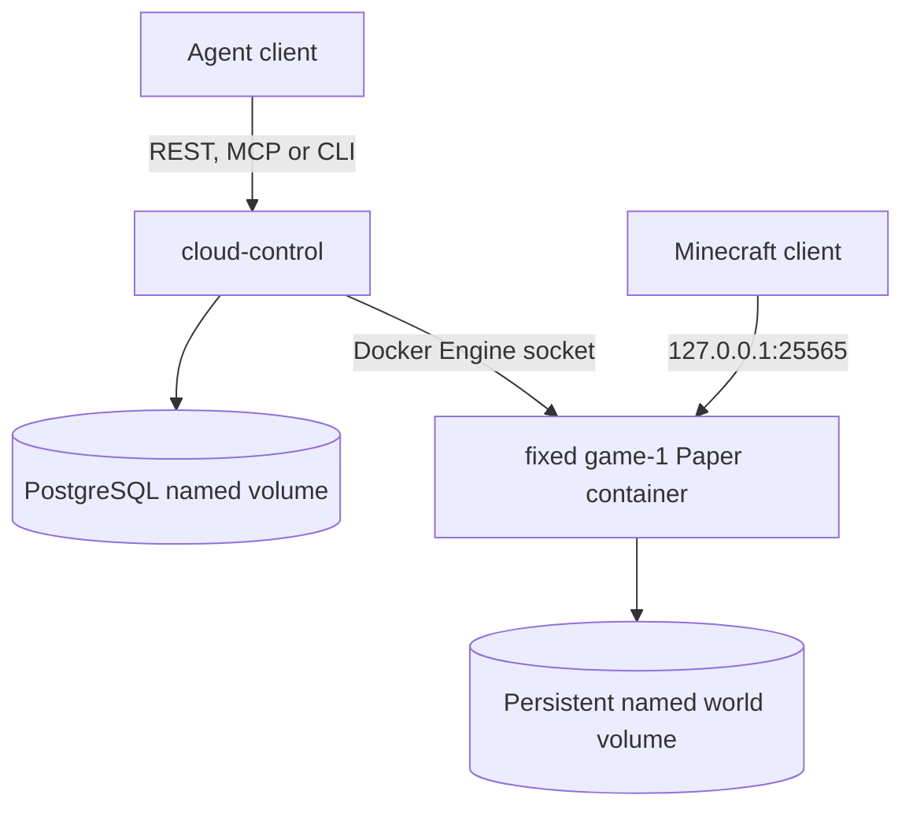
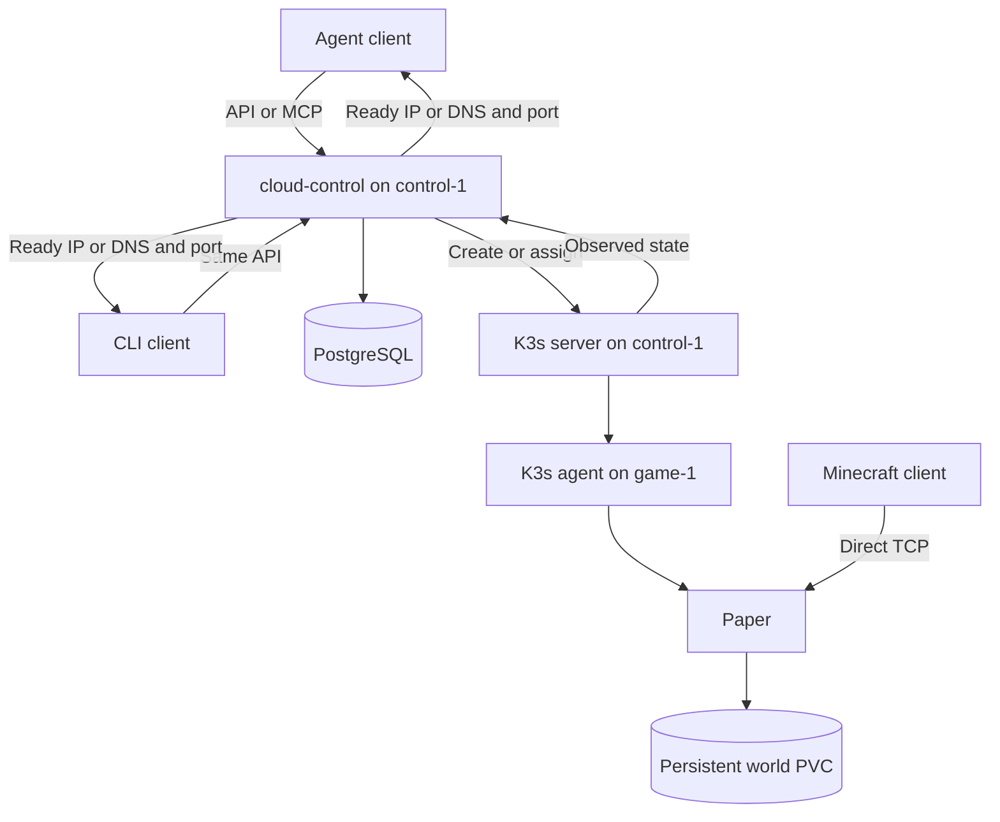
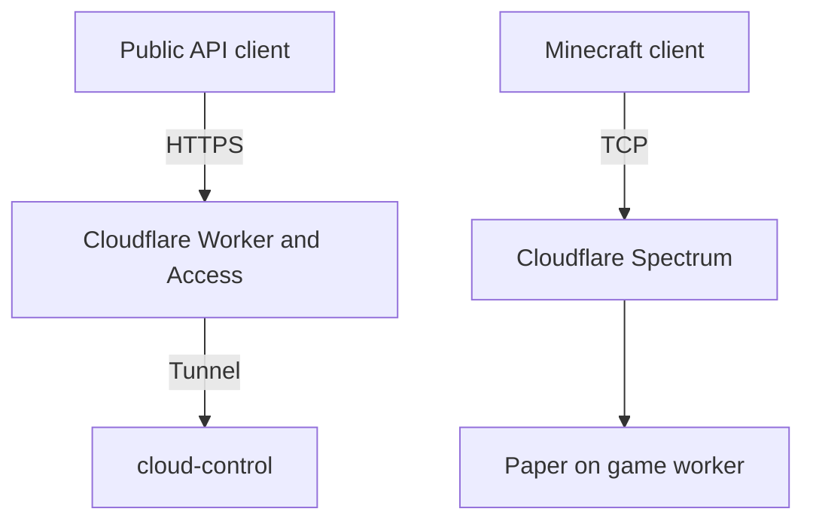

# Architecture

This is the selected design for Cloud's reproducible single-host Compose foundation and the later managed service. The two-host K3s path remains historical evidence from F1/F2. The [repository overview](../README.md) distinguishes the available tools and evidence from the planned runtime; [decisions](decisions.md) records changes to the design.

## Product boundaries

Host runs game servers. Deploy will run a curated application catalog. Both need accounts, permissions, resource admission, persistent data and an activity record. They do not necessarily need the same runtime or stopping policy.

Minecraft Java is the first Host workload. Its selected profile is Paper 26.2 build 121 with two CPU quota units, a 2 GiB heap, a 3 GiB total container RAM limit, view distance 6 and simulation distance 4. The [profile and evidence](../benchmarks/minecraft/free-profile-results.md) record the resources, two-player bot activities and local recovery checks for one running instance on the tested Oracle A1 host. They do not qualify simultaneous warm-plus-active capacity. Paid variants and other games follow their own qualification. Deploy starts with maintained application recipes; arbitrary user code remains a later stage. Continue, the agent-hosting product explored in earlier documents, is excluded.

The [catalog](../catalog/README.md) separates the product, its executable recipe, the tested resource profile, the evidence and the commercial offer. A recipe describes how to run a workload. A profile identifies exactly what was tested. An offer applies access, limits and pricing to a qualified profile. Adding an offer does not make an untested configuration supported.

## Supported local Compose path

The supported local installation runs one `cloud-control` container, PostgreSQL
and one fixed Paper `game-1` container under Docker Compose. PostgreSQL and the
world use named volumes. `game-1` is created stopped, then `cloud-control`
starts and stops it through the Docker Engine socket. The socket is mounted
only into `cloud-control`; Paper receives no Docker credentials.

The runtime discovers the fixed container through the Compose project and
service labels and verifies its name and `/data` volume before every action.
Its healthcheck uses a Minecraft protocol status request. A healthy container
returns the stable loopback endpoint; a running container without protocol
readiness remains `starting`. Docker's stop request uses the Paper save grace
period and returns only after the container exits.

One Compose installation admits one logical server. A second distinct create
returns a durable capacity error. PostgreSQL serializes competing creates for
the operator before checking the configured `CLOUD_MAX_SERVERS` limit. Setup
and shutdown preserve named volumes; volume removal is a separate explicit
destructive command.

The current F3/F4 tasks add the remaining REST, MCP and CLI operations and
exercise the complete request-to-play journey on this supported path.

## Historical two-host path

`cloud-control` will start as one TypeScript process for REST, MCP, admission and reconciliation. PostgreSQL will store ownership, requested state and pending work so a control restart can resume an operation. A CLI will use the same API contract. It is a client, not a separate control path. A web interface may use the API later, but it is not a foundation prerequisite.

The historical topology has two roles:

| Role | Runs |
| --- | --- |
| `control-1` | K3s server, PostgreSQL and `cloud-control` |
| `game-1` | K3s agent, Minecraft and its local volumes |

Games stay off the control host. K3s is the first actual runtime. Local containers, mocks and other tools may support development, but they do not gate or prove two-host acceptance.

The foundation will return a directly reachable `game-1` IP and port or a DNS-only address after Minecraft accepts a protocol connection. Player TCP will go directly to `game-1`. The proof will record the exact path and exposure.

The reachable control API requires minimum machine-token authentication. `cloud-control` will use a dedicated Kubernetes identity with only the permissions required for the lifecycle contract. Administrative endpoints, RCON, PostgreSQL and cluster administration remain private. Public registration and end-user identity are managed-service work.

## Future public path

This diagram shows the later managed public service. Cloudflare Worker, Tunnel and Access protect the public control path. Spectrum becomes the final public-opening gate for Minecraft TCP. Public registration, billing, operating at public scale and remote disaster recovery also belong to that service. They do not block the reproducible direct path or publication of its code and evidence. [Cloudflare's proxy documentation](https://developers.cloudflare.com/fundamentals/reference/network-ports/) distinguishes its HTTP ports from other TCP services. [D5](decisions.md#d5-public-game-tcp-and-worker-ip-exposure-updated-2026-09-06) records the public-game sequence.

If `control-1` fails, an existing game can continue on healthy `game-1`. New operations wait for control recovery. The foundation must prove that durable requests resume after `cloud-control` restarts. Restoring the control host or a world on another worker remains part of later remote disaster-recovery acceptance.

## Identity, requests and runs

A logical server keeps its owner, endpoint, recipe, profile and data while offline. A run is one admitted execution of that server. A stopped process does not delete the logical server or its world.

The first acceptance flow is `create → start → status → connect → stop` through an agent using API or MCP. The CLI exercises the same contract. The agent receives no Kubernetes or host credentials. A status page is not required for this result.

For each mutation, `cloud-control` validates the token, ownership, arguments and quota, then commits the intended state in PostgreSQL. A reconciler applies the corresponding resources using stable identifiers and records what actually happened. External calls do not hold an open database transaction.

REST and MCP share a durable `client_request_id`. The same owner, operation, key and body return the recorded result. Reusing the key with a different body returns a conflict. Transport request IDs do not substitute for this key. State constraints also enforce at most one active start request and one active run per logical server.

Acceptance covers both a cold start and assignment of a ready, unowned warm instance. The current profile qualifies one running Paper instance, so cold and warm paths can run as separate acceptance trials. A ready warm instance consumes that slot. Assignment binds the clean instance and its world to one owner before returning it. The platform cannot refill the warm slot while that owned server remains active unless a new capacity test qualifies the combination. Warm capacity can never contain or reuse another owner's world. Restarting an existing logical server restores its own data. Warm availability depends on unused qualified capacity, so the API does not promise zero-latency start.

## Process and data lifecycle

The selected Kubernetes design uses a `Deployment` with `Recreate` and zero or one replicas, plus an explicit PVC for `/data`. The PVC lives independently of the Deployment. The earlier StatefulSet design is superseded.

The first admitted cold start creates the PVC, then starts the pinned recipe. Readiness means that Minecraft accepts a protocol connection. Normal starts reuse the logical server's local volume on `game-1`. The platform must preserve the owner-to-world binding through stop, start and `cloud-control` restart.

An explicit deployment setting enables preparation of an unowned warm instance while capacity is free. If the only slot holds that unowned instance when an existing server needs to restart, control stops the unowned process before starting the existing server with its own world. It never evicts an owned active server to make room.

The foundation's manual stop uses this path:

1. Store the requested offline state and scale the Deployment to zero.
2. Allow Minecraft to save and exit through its normal termination path.
3. Wait for termination before marking the run stopped.

The later managed service keeps run state and backup state separate. A server may be offline while its backup is pending or failed. A verified upload becomes a proven recovery copy only after a restore test opens and checks the restored world.

`Recreate` orders replacement during Deployment upgrades; it does not guarantee one writer after every kind of Pod deletion. `ReadWriteOnce` can also permit multiple Pods on the same node. The implementation must prevent another writer until the previous one has stopped. Foundation lifecycle acceptance must exercise interrupted stops and replacement. See [Deployment strategy](https://kubernetes.io/docs/concepts/workloads/controllers/deployment/#recreate-deployment) and [volume access modes](https://kubernetes.io/docs/concepts/storage/persistent-volumes/#access-modes).

The runtime manifests ([catalog/games/minecraft-java/paper/k8s/](../catalog/games/minecraft-java/paper/k8s/)) propose layers meant to close this gap. They use `Recreate` with a 120s `terminationGracePeriodSeconds` matching the itzg image's SIGTERM save path. A PVC on a `local-path-retain` StorageClass uses `Retain` reclaim policy and `WaitForFirstConsumer` binding. Its node affinity forces any replacement Pod onto the same node and filesystem instance. The `Retain` policy means scaling to zero does not delete the world. Minecraft's `session.lock` crashes a racing second process. A `hostPort` binding provides OS-level exclusion. A dedicated `ServiceAccount` has no RoleBinding, so the container cannot reach the Kubernetes API to force a second replica. This mechanism has not been exercised on the real two-host K3s runtime. The runbook's first five interrupted-stop and replacement scenarios must pass before this risk is resolved. Its node-loss and remote recovery drill belongs to the managed service.

Later remote recovery starts by isolating the old worker. It restores into a new PVC on another worker, validates the data in Minecraft, updates the active volume and game endpoint, then closes the incident. An unreachable worker is not proof that it stopped writing.

The foundation uses local volumes. The planned managed service adds R2 backups and operated recovery. It promises no automatic movement of a live local volume, zero data loss after worker failure or fixed recovery time. Remote recovery work must measure lost progress and recovery duration before the service states those limits. Replicated storage is a separate decision if the measured result is unacceptable.

## Admission and operating policies

The foundation uses one qualified resource profile. Admission must bound active and warm instances by measured CPU, RAM, disk pressure, reservations and host overhead. It must reject or defer work instead of oversubscribing `game-1`. An existing local volume also restricts which worker can accept that start.

Current acceptance covers one running Paper instance with two players. Running a ready warm instance beside an active owned instance changes the capacity and latency conditions and needs its own measurement before that combination becomes accepted capacity. The failed two-active-instance run does not establish that an active instance and an idle warm instance cannot coexist.

Reservation windows, a user queue and AutoStop belong to the managed service. AutoStop waits for a measured empty server; a failed player-count query is an error, not zero players.

An application cannot inherit that policy without review:

| Workload | Recipe must define |
| --- | --- |
| Game server | Protocols, readiness, player detection, safe stop, world format and acceptable playing quality |
| Web application | HTTP readiness, background jobs, secrets, data dependencies and whether any idle stop is safe |
| Database or other persistent service | Consistent backup, restore verification and the availability required by its clients |

There is no generic rule to stop Deploy workloads after a period without HTTP requests. Runtime and isolation choices remain open until the first curated application has a concrete operating contract. Docker Sandboxes was a research candidate, not a selected Deploy dependency.

## Trust boundaries

The foundation accepts maintained recipes and validated options. User-supplied images, commands, manifests, plugins and world uploads are outside that initial boundary. Each later capability needs its own input handling, resource limits and tests of isolation between owners.

Workload processes run without host privileges or Kubernetes API credentials. `cloud-control` gets only the resource permissions it needs. RCON, PostgreSQL and cluster administration remain private. The infrastructure and recipe checks must verify these restrictions. Their presence in this document is not evidence that they are deployed.

Local PVC capacity requests are not an enforced filesystem quota. The profile's `world_soft_limit_gb: 4` and the manifest's 10 GiB PVC request are independent values. Neither proves that the platform stops a world at that size. The foundation must monitor host storage and stop new admission before exhaustion. Exact per-server disk limits need a tested enforcement mechanism before public registration.

## Evidence before an offer

Each [qualification](../catalog/README.md) identifies software versions, image digest, CPU architecture, host class, memory, CPU limits, disk, configuration and workload. It tests real actions and persistence as well as process health. A software version, loader or modpack can change both compatibility and cost.

Minecraft qualification compares candidates under equal conditions, then measures simultaneous instances with host overhead and spare capacity. TPS, chunk waits, disconnects, action delays and recovery each provide separate evidence. The owner accepted the repeated bot workload for profile selection on 2026-09-06. Human play and the Spectrum route remain public-opening checks. The [results](../benchmarks/minecraft/free-profile-results.md) preserve the failed two-instance level and distinguish profile acceptance from a working platform.

Code publication requires a clean clone, two compatible hosts and operator-owned credentials to reproduce the bounded foundation from the published instructions. The same release must include the code, instructions and evidence. This requirement does not claim that the later managed public service exists.
